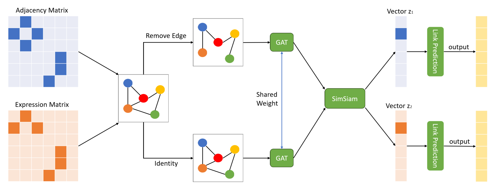
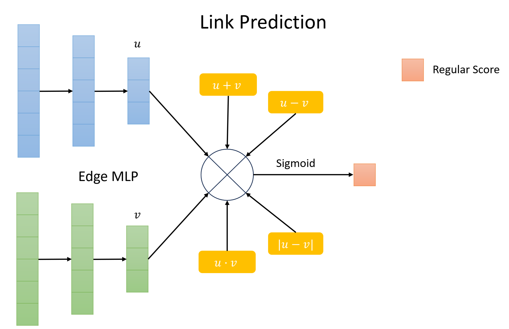
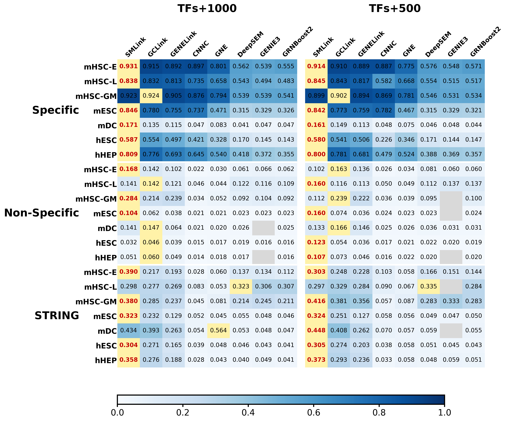

# 1. 相关工作

在图神经网络方法中，GENELink 将基因调控网络推断建模为图上的链路预测任务，通过图注意力网络聚合邻域信息，能够同时利用基因表达特征与网络拓扑结构学习节点表示。相较于仅从基因对出发进行独立预测的方法，GENELink 不再孤立地判断单个 TF–target 基因对，而是将候选调控关系放在整体图结构中加以分析，因此在结构信息利用方面具有明显优势。也正因为如此，GENELink 为后续方法提供了一个较为合理的图建模基础。

然而，GENELink 的建模过程主要依赖于单一的先验图结构。当已知调控边较少、先验网络不完整，或者图中存在噪声边时，模型可利用的有效结构信息会受到限制，进而影响节点表示学习与最终链路预测的准确性。此外，GENELink 更侧重于在固定图结构上进行监督学习，对于图结构扰动下表示稳定性的建模仍然不足，这使得模型在稀疏场景、受扰动场景以及小样本场景中的适应能力仍有进一步提升空间。

# 2. 新算法

## 2.1 引入

基于上述认识，本文在 GENELink 的基础上提出 SMLink。SMLink 继承了 GENELink 将 GRN 推断建模为图链路预测问题的基本思想，保留了利用图注意力机制融合表达特征与拓扑结构信息的核心框架，但并不局限于在单一固定图上学习，而是进一步围绕结构鲁棒性、表示稳定性和边关系表达能力进行了针对性增强。

## 2.2 工作细节

### 2.2.1 双视图图学习机制

在真实的生物调控网络中，先验图通常存在稀疏性和噪声边，这会导致节点表示学习受到严重影响。GENELink 仅依赖单一的先验图进行训练，因此在面对缺失边或错误边时，节点表示容易偏离真实结构，从而影响链路预测的准确性。

SMLink 针对这一问题进行了系统性的改进。通过在训练阶段构建扰动图与原图的双视图训练，模型能够在节点表示学习过程中接触到边缺失或结构扰动的情况，从而减少对单一图结构的依赖。同时，利用跨视图一致性约束，使节点在不同图视图下的表示保持稳定，从而进一步缓解噪声边对表示的干扰。这种设计使 SMLink 在稀疏或不完整先验网络条件下，依然能够生成稳健且具有判别力的节点表示，为边预测提供了可靠基础。

这种设计的逻辑优势在于，SMLink 学到的不是某一份具体先验图的表面结构，而是节点在图扰动下仍保持稳定的核心表示。因此，当真实应用中先验边较少、标注不足时，模型仍具备较好的适应能力。实验结果同样表明，在极低网络密度条件下，SMLink 在大多数数据集上的 AUPRC 仍优于其他监督或无监督基线，说明这种面向稀疏场景的设计具有实际有效性。

实验分析表明，这一机制不仅提升了节点表示的稳定性，也使模型在链路预测任务中对稀疏和噪声网络的适应性明显增强。通过扰动图训练，模型学会识别哪些节点特征和邻域信息在结构不完整时仍具有稳定性，而一致性约束保证了表示在不同图结构下的一致性，从而降低预测误差。

### 2.2.2 跨视图表示的一致性约束

SMLink 的另一项关键优势体现在其一致性学习思想。与显式依赖负样本分离的对比学习不同，SMLink 更强调跨视图表示的一致性约束，从而在不过度干扰主任务的前提下增强表示稳定性，以此提升节点表征质量。

这种一致性约束的价值主要体现在两个方面。第一，它能够缓解模型对单一图结构的过拟合，使表示更稳定；第二，它能够在标注不足时利用结构扰动带来的自监督信号，增强模型的泛化能力。原始研究中的消融实验表明，引入对比学习后，模型在 AUPRC 上获得提升，同时 AUROC 的标准差下降，说明该策略不仅提升了性能，也改善了训练稳定性。

因此，SMLink 的优势并不只是加入了额外损失函数，而在于它通过一致性学习，使模型真正具备了对图缺失、图扰动和样本不足场景的耐受性。

### 2.2.3 更强的边建模

对于 GRN 推断而言，模型最终要解决的是“如何判定两个节点之间是否存在调控边”。这一步实际上决定了模型能否将前面学到的节点表示有效转化为高质量的边预测结果。

从生物学的角度来看，TF–target 调控关系并不只是简单的相似性关系，而往往具有方向性、非线性和复杂交互特征。因此，一个优秀的解码模块不能仅仅判断两个节点“是否接近”，还应能够刻画它们之间更丰富的关系模式。GENELink 等传统方法只使用了点积对边关系进行刻画。该方法确实大大提升了运行速度，但是也同样损失了边信息。

SMLink 的突出之处，正在于其边级关系建模更强调对节点对交互的直接刻画。此方法从六个不同的角度刻画两节点之间边的关系，从而使模型在恢复真实调控边时拥有更高的表达能力。

这种优势尤其重要。因为在 GRN 推断任务中，真正困难的往往不是节点表示本身，而是如何利用表示准确地区分真实正边与大量潜在负边。研究结果显示，SMLink 相比 GENELink 等方法在 AUPRC 上更具优势，并能更好地区分正负基因对，这也从侧面说明更强的关系建模与更稳定的表示学习共同提升了边预测质量。

# 3. 实验结果和分析

为了全面评估 SMLink 在单细胞基因调控网络（GRN）推断中的性能，我们在多组数据集上进行了比较，包括 Specific、Non-Specific 以及 STRING 三组数据集。该图展示了不同方法在 **TFs+1000** 和 **TFs+500** 特征条件下的 AUPRC 比较结果。

## 3.1 综合性能

在 Specific 中，SMLink 明显优于对比方法，包括 GENELink、CNNC、GNE、DeepSEM、GENIE3 和 GRNBoost2。例如，在 mHSC-E 和 mHSC-GM 数据集上，SMLink 的 AUPRC 达到 0.923–0.931，较 GENELink 提升约 1% ~ 3%，而传统方法表现普遍低于 0.90（图左侧 TFs+1000 栏）。这一结果表明 SMLink 在捕捉正调控边的能力上具有明显优势，能够有效识别真实调控关系，同时抑制假阳性。

在 TFs+500 条特征条件下，SMLink 依然保持高性能，AUPRC 较 GENELink 提升明显，显示其在低特征信息条件下仍能稳健运行。这证明 SMLink 的双视图训练和一致性学习策略在少样本或稀疏特征环境中仍能保证节点表示稳定，边预测可靠。

## 3.2 稀疏与非特定网络的鲁棒性

在 Non-Specific 数据集和 STRING 数据集上，SMLink 的 AUPRC 同样优于对比方法。例如，在 mHSC-GM 和 mDC 的非特定条件下，SMLink 的预测精度显著高于 GENELink 与 CNNC，即便网络稀疏或存在噪声边，其鲁棒性仍保持优势（图右侧 TFs+500 栏）。这说明 SMLink 能够在结构不完整和非特定调控背景下稳定提取节点核心信息，从而保持高质量的边预测。

## 3.3 与其他方法的比较

传统方法（CNNC、GNE、DeepSEM、GENIE3、GRNBoost2）多依赖局部基因对特征，难以捕捉全局拓扑信息，特别是在稀疏和噪声网络条件下表现不佳（AUPRC 常低于 0.3–0.4）。

相比之下，GENELink 虽然有所增进，然而其依赖单一图结构，节点表示容易受稀疏或扰动影响，AUPRC 在低标注或非特定数据集下降明显。。

相比之下，SMLink 通过 双视图训练、SimSiam 一致性学习、边级非线性建模，能够学习节点在不同扰动或稀疏条件下保持稳定的核心表示，从而在边预测中保持高精度。具体表现为：

1. **稳健性**：双视图和一致性约束保证节点表示在扰动、稀疏和低特征条件下稳定。
2. **正样本识别能力强**：特定数据集 AUPRC 明显高于其他方法。
3. **泛化能力优**：非特定和 STRING 数据集同样表现优异，表明模型对不同网络结构和数据场景均适用。
4. **整体性能最优**：在 42 个数据集中，SMLink 在 30 个数据集取得 SOTA，相比 GENELink 与其他基线方法具有显著优势，展示了其在单细胞 GRN 推断任务中的稳健性与可靠性。